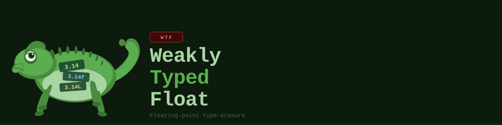

.. Copyright 2025 NWChemEx-Project
..
.. Licensed under the Apache License, Version 2.0 (the "License");
.. you may not use this file except in compliance with the License.
.. You may obtain a copy of the License at
..
.. http://www.apache.org/licenses/LICENSE-2.0
..
.. Unless required by applicable law or agreed to in writing, software
.. distributed under the License is distributed on an "AS IS" BASIS,
.. WITHOUT WARRANTIES OR CONDITIONS OF ANY KIND, either express or implied.
.. See the License for the specific language governing permissions and
.. limitations under the License.

######################
WeaklyTypedFloat (WTF)
######################

The WeaklyTypedFloat (WTF) library provides a small domain-specific language
which can be used to express operations and interfaces in terms of "weakly 
typed" floating-point objects -- ``Float`` and ``FloatBuffer``. This enables
users of WTF to wirte one set of functions and defer selecting floating-point 
types until runtime, without needing to rely on heavy C++ meta-programming.

To learn more about why WTF is needed see :doc:`statement_of_need`, otherwise
we recommend starting with :doc:`installation` and :doc:`quickstart`.

.. toctree::
   :maxdepth: 1
   :caption: Contents

   statement_of_need
   installation
   quickstart
   writing_apis
   restoring_the_type
   adding_a_new_type
   writing_a_visitor
   python_bindings
   developer/index

.. toctree::
   :maxdepth: 1
   :caption: APIs:

   C++ API <https://nwchemex.github.io/WeaklyTypedFloat/wtf_cxx_api/index.html>
